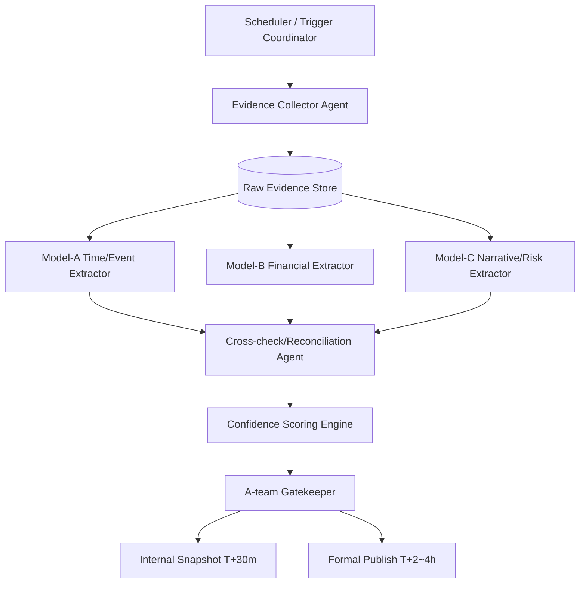
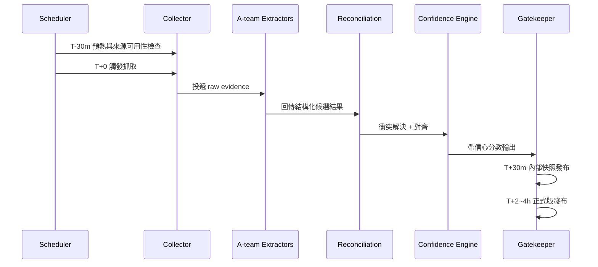

# Earnings Evidence「方案3 + A-team」設計草案（CLI 接手版）

## 1) 本次討論結論（可追溯）

- 使用者要求主時間格式改為 **台灣時間（UTC+8）**。
- Broadcom 日期認知差異：
  - 使用者提供：**2026/06/04（台灣時間）**
  - 目前外部資料常見：**2026/06/03（美東盤後）**，換算台灣時間通常是 **2026/06/04 清晨**。
- 先不做「即時 API 觸發」上線版本，先以 **靜態 Marvell 範例**做驗證。
- 任務 4 要求整理成「**方案3 + A-team sub-model/agent**」：
  - 整體架構
  - prompt 模板設計
  - confidence scoring 設計
  - 文件 / 流程 / 架構圖
- 本文件目的：讓你切換到 CLI 後，可以直接針對本 PR 接手設計與實作。

---

## 2) 事件時間（先供驗證，全部以台灣時間為主）

### Broadcom（AVGO）
- 目標窗口：Calendar Year 2026 Q2
- 目前共識寫法（建議）：
  - **US/Eastern:** 2026-06-03 17:00 ET（盤後）
  - **Taiwan (UTC+8):** **2026-06-04 05:00**（若以 EDT, UTC-4 換算）
- 註：若後續官方 PR/IR 更新實際分鐘或時段，以官方 IR 為準。

### Marvell（MRVL）
- 先行範例：Calendar Year 2026 Q2 對應 Marvell FY2027 Q1 call
- 建議暫定：
  - **US/Pacific:** 2026-05-27 13:45 PT
  - **US/Eastern:** 2026-05-27 16:45 ET
  - **Taiwan (UTC+8):** **2026-05-28 04:45**

---

## 3) 方案3 + A-team：整體架構

核心精神：以「可審計（evidence-first）」為核心，讓多個 sub-model/agent 分工，最後由 A-team Gatekeeper 匯總發布。

### 3.1 元件分工

1. **Scheduler / Trigger Coordinator**
   - 管理 T-30m / T+0 / T+15m / T+30m / T+2h~4h 任務節點。
2. **Evidence Collector Agent**
   - 抓取 IR 新聞稿、webcast、transcript、第三方鏡像；保存 raw snippet + URL + location hint。
3. **Extraction Agents (A-team sub-models)**
   - Model-A: 時間與事件抽取（event time / timezone / fiscal vs calendar mapping）
   - Model-B: 財務數字抽取（營收、毛利率、EPS、segment）
   - Model-C: 敘事與風險抽取（guidance、風險、管理層語氣）
4. **Cross-check / Reconciliation Agent**
   - 對多來源與多模型結果做一致性比對，產生衝突清單。
5. **Confidence Scoring Engine**
   - 按規則計分（來源可靠度、交叉驗證、時間一致性、數值可追溯性）。
6. **A-team Gatekeeper / Publisher**
   - 輸出內部版本與正式版本，附上 High/Medium/Low 信心與 unresolved items。

### 3.2 架構圖



### 3.3 流程圖（時間軸）



---

## 4) Prompt 模板設計（A-team sub-model/agent）

> 設計原則：固定輸入欄位、固定 JSON 輸出、強制附 evidence pointer。

### 4.1 Model-A（時間/事件）

```text
[System]
You are Model-A (Event Time Extractor). Extract only event-time facts.
Return strict JSON.

[Input]
company={{company}}
symbol={{symbol}}
target_window={{target_window}}
primary_timezone=Asia/Taipei
raw_evidence={{evidence_blocks}}

[Task]
1) Find earnings event datetime.
2) Normalize to ET/PT/UTC+8.
3) Mark fiscal-quarter and calendar-quarter mapping.
4) For each claim, attach source_id + location_hint.

[Output JSON Schema]
{
  "event_candidates": [{
    "event_time_et": "...",
    "event_time_pt": "...",
    "event_time_tw": "...",
    "fiscal_mapping": "...",
    "calendar_mapping": "...",
    "evidence": [{"source_id":"...","location_hint":"..."}],
    "notes": "..."
  }],
  "conflicts": ["..."]
}
```

### 4.2 Model-B（財務數值）

```text
[System]
You are Model-B (Financial Metrics Extractor). Extract only numeric financial metrics.
Return strict JSON with evidence pointers.

[Input]
company={{company}}
symbol={{symbol}}
raw_evidence={{evidence_blocks}}

[Task]
Extract revenue, gross_margin, EPS, segment metrics, guidance.
If metric appears in multiple sources, keep all candidates.

[Output JSON Schema]
{
  "metrics": [{
    "label": "Revenue",
    "value": "...",
    "unit": "USD",
    "period": "...",
    "evidence": [{"source_id":"...","location_hint":"..."}],
    "candidate_rank_hint": "primary|secondary"
  }],
  "conflicts": ["..."]
}
```

### 4.3 Model-C（敘事/風險）

```text
[System]
You are Model-C (Narrative & Risk Extractor). Extract management guidance, tone, and risks.
Return strict JSON only.

[Input]
company={{company}}
symbol={{symbol}}
raw_evidence={{evidence_blocks}}

[Task]
Summarize key narrative claims and risk statements.
Attach quote + evidence pointer for each claim.

[Output JSON Schema]
{
  "narrative_items": [{
    "theme": "guidance|risk|demand|supply",
    "claim": "...",
    "quote": "...",
    "evidence": [{"source_id":"...","location_hint":"..."}],
    "materiality": "high|medium|low"
  }]
}
```

---

## 5) Confidence Scoring 設計

### 5.1 Score 維度

- **Source Reliability (0-35)**
  - 官方 IR/SEC 高於第三方鏡像。
- **Cross-source Consistency (0-25)**
  - 多來源一致加分；互斥資訊扣分。
- **Extraction Agreement (0-20)**
  - Model-A/B/C 或 rerun 一致性加分。
- **Traceability Completeness (0-10)**
  - 是否完整提供 source_id + location_hint + quote。
- **Timezone/Period Integrity (0-10)**
  - ET/PT/TW 轉換是否一致，fiscal/calendar 對應是否正確。

總分：`score = SR + CS + EA + TC + TI`（0~100）

### 5.2 等級規則

- **High:** >= 85
- **Medium:** 70~84
- **Low:** < 70

### 5.3 發布門檻

- 事件時間（event time）若低於 Medium，不可進正式版。
- 財務主指標（Revenue/EPS）任一為 Low，正式版需標記「待確認」。
- 若有高衝突來源（官方 vs 第三方矛盾），需 Gatekeeper 人工覆核。

---

## 6) 產出物定義

1. **Internal Snapshot（T+30m）**
   - 快速版本，允許 Medium，需列 unresolved。
2. **Formal Publish（T+2~4h）**
   - 需完成重跑與覆核，重點欄位至少 Medium，事件時間建議 High。
3. **Audit Bundle**
   - source list、引文、衝突解決紀錄、score trace。

---

## 7) CLI 接手指引（針對本 PR）

切換到 CLI 後，請接手此 PR 並按以下順序：

1. 先讀本文件：
   - `docs/earnings-evidence-a-team-design-2026-05-27.md`
2. 再讀實作計畫：
   - `docs/earnings-evidence-a-team-cli-handoff-plan-2026-05-27.md`
3. 先落地「靜態 Marvell 範例」與台灣時間顯示。
4. 再分階段導入 sub-model/agent + confidence engine。

---

## 8) 總結與成功標準

- 本輪已完成可交接的設計文件，重點是「台灣時間優先 + evidence-first + A-team 分工」。
- CLI 接手後第一個里程碑是完成靜態 Marvell 範例並可在頁面驗證 TW 時間。
- 第二個里程碑是校準 Broadcom CY2026-Q2 時間並整理來源差異說明。
- 第三個里程碑是建立 sub-model/agent prompt 與 confidence scoring 實作骨架。

若以上三個里程碑都達成，即可進入「真 API 即時觸發」階段的實作與驗證。

---

## 9) CLI 接手實作結果（2026-05-27）

### 已完成的里程碑

✅ **里程碑 1：靜態 Marvell 範例 + 台灣時間優先呈現**
- `app/data/earningsEvidenceData.ts`: 新增 `marvellCalendarQ22026Case`
- `app/earnings-evidence/page.tsx`: 以 Marvell 為主，Taiwan (UTC+8) 置於第一欄
- 新增 `ee-label--primary` / `ee-value--primary` CSS 修飾符

✅ **里程碑 2：Broadcom CY2026-Q2 時間校準**
- `broadcomCalendarQ12026Case` → `broadcomCalendarQ22026Case`
- targetWindow 改為 Calendar 2026 / Q2
- eventTimeTw 校準為 `2026-06-04 05:00 (UTC+8)`（EDT 換算）
- Confidence 設為 Medium (72) — 待官方 IR 確認後升為 High

✅ **里程碑 3：A-team sub-model/agent prompt + confidence engine 骨架**
- `docs/earnings-evidence-model-a-prompt.md` — 時間/事件抽取模板
- `docs/earnings-evidence-model-b-prompt.md` — 財務數值抽取模板
- `docs/earnings-evidence-model-c-prompt.md` — 敘事/風險抽取模板
- `docs/earnings-confidence-scoring-spec.md` — 計分維度、等級、發布門檻
- `app/lib/earningsEvidencePipeline.ts` — 靜態管線 stub（5 階段介面）
- 頁面新增「Pipeline Run (Static Stub)」顯示區

### Build 結果
- `npm run build` ✅ 527 static pages generated, 0 errors
- `/earnings-evidence` 頁面正常生成

### 下一步（真 API 即時觸發階段）
1. 將 `runStaticEvidencePipeline` 替換為真實 collector API 呼叫
2. 接入 Model-A/B/C（LLM 呼叫）並回傳結構化 JSON
3. 建立 Reconciliation Agent 邏輯
4. 上線 Confidence Scoring Engine 計分規則
5. 實作 Gatekeeper publish gate（Internal / Formal 兩階段）
